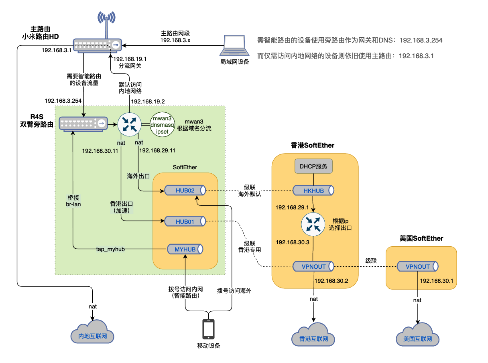

## OpenWRT双臂SoftEther旁路由上网

#### 项目概述

SoftEther是一个功能强大的软交换机，可以用它灵活地搭建各种上网环境，实现家庭和办公环境之间的网络互联互通。SoftEther可以替代向代理或内网穿透等技术，让你可以跨越公网和私网，跨越内地和海外，把复杂的网络变为局域网一样透明和方便使用。

本项目是以SoftEther和Operwrt配合，构建一个双臂旁路由上网环境。本方案支持多个家庭共享海外出口，只需让SoftEther中的tap网卡的ip分配好，不冲突就可以了。本方案也可以进行扩充，多加入一个虚拟Hub，实现不同局域网之间相互访问。具体网络结构如下图：



方案的思路是使用SoftEther的级联功能搭建起一个内地、香港和美国的网络架构，其中在香港和美国各有一个互联网出口。然后利用OpenWRT上的mwan3插件，配置根据域名进行路由选择的策略，实现合理和科学的上网。

#### 旁路由的好处

方案中采用的是双臂旁路由。是从单臂旁路由改进而来，解决了单臂方案中上下行流量都走同一条网线的弊端（会让最高网络速度变为物理带宽的1/3左右）。另外旁路由相比主路由方案，还有一下好处：

1. 旁路不会影响主路由，喜欢折腾的可以各种实验，不会影其它人正常上网。
2. 用户依然可以使用各大路由厂商路由器本身的功能，这些功能通常简单实用，还提供手机App控制路由等非常必要的功能。
3. SoftEther需要耗费较多的CPU性能，使用专门的设备来运行以确保网络访问速度。

#### 硬件环境

下面以友善的R4S作为软路由硬件，比以友善官方OpenWrt固件为基础说明如何安装和配置旁路由。主路由使用小米路由HD。小米路由需要按照官方指引开启路由器的SSH访问，以便对路由器进行正常WEB UI无法完成的配置。用其它品牌作为主路由，配置需要参考小米的来做就可以了。如果主路由无法进行方案所需的配置，可以把本方案从双臂改为单臂（R4S的WAN口不插网线即可）。

#### 前期准备

* 刷好官方固件后，把R4SWAN口接上可以访问互联网的局域网，LAN口则连接到笔记本，使用SSH访问设备进行安装配置
* 卸载掉官方固件的docker模块

```
opkg remove luci-app-docker-ce
opkg remove docker-ce

# docker及容器中有特权的系统可以操控设备的网络环境，导致路由工作异常，建议卸载
# docker会影响路由本身的端口映射，如果R4S作为主路使用就必须卸载掉docker
```

* 安装一些调试必备软件

```
opkg update
opkg install openssh-sftp-server  # 方便使用sftp客户端访问和修改文件
opkg install mtr # 检查实际路由走向
opkg install iperf3 # 测试网络速度
```

* 作为旁路由需要修改LAN口配置

```
- 静态ip 192.168.3.254
-	网关：192.168.3.1
-	DNS：192.168.3.1
- 关闭本接口的DHCP服务

# 本文的局域网段设定为192.168.3.x，如与你的网络环境不一致，要按实际环境替换对应ip
```

* 把R4S的WAN口拔掉，把LAN口接到局域网

```
此时你应该可以通过局域网访问R4S，R4S也可以访问互联网。然后就可以继续下面的安装步骤
```

#### 把R4S的WAN口改为分流上行接口

* 修改接口设置：lan

```
- 强制链路：关闭（插板网线可以从新设置路由）
- 接口跃点设为50 （跃点要求比lan2rt大，比所有其它有默认路由的接口小）
```

* 新增接口：lan2rt

```
绑定网卡：eth0
协议：静态网址
IP：192.168.19.2
掩码：：255.255.255.000
网关：192.168.19.1
内置IPv6管理：禁止
强制链路：关闭 （拔掉网线可以自动变为单臂旁路由）
网关跃点：0
DHCP：关闭
```

* 为lan2rt新增一个防火墙区域

```
新增区域：lan2rt
涵盖网络：lan2rt
入站数据：接受
出站数据：接受
转发：接受
```

* 禁止原来的wan和wan6接口

```
- 接口协议：不配置
- 把接口移出防火墙的wan区域
```

* 在主路由上添加与R4S中的lan2rt接口对应的ip

```
修改小米路由的网络配置文件,在/etc/config/network中增加：
config interface lan1
       option 'ifname' '@lan'
       option 'proto' 'static'
       option 'ipaddr' '192.168.19.1'
       option 'netmask' '255.255.255.0'
       
重启网络：
/etc/init.d/network restart

# 此时把R4S的WAN口接入局域网，从小米路由就可以ping通R4S上的192.168.19.2
```

* 测试网络连通性

```
- 把你电脑的网卡临时改为静态ip
ip：192.168.19.10
掩码：255.255.255.0
网关：192.168.3.254
DNS：192.168.3.254

- 把R4S的WAN口接入局域网并，测试电脑是否可以访问注路由和互联网
```

##### 配置SoftEther

* 安装SoftEther

```
opkg install softethervpn-server

注：不要安装softethervpn5-server，因其启动脚本有问题
```

* 配置SoftEther

```
使用SoftEther的图形化管理工具对SoftETher进行配置（仅Window提供图形化工具）
- 创建虚拟HUB：MYHUB、HUB01、HUB02
- 把以上虚拟HUB桥接到本地网络，每个虚拟HUB绑定一个tap网卡（名字为myhub、hub01、hub02)
- 为MYHUB和HUB02创建用户（移动端VPN拨号访问使用到用户和密码）
- 开启 L2TP over IPsec服务，设置共享密钥（移动客户端L2TP拨号需要使用到）
- 建立虚拟HUB级联：
	HUB01与香港的VPNHUB级联，级联的最大连接数设为32
	HUB02与香港的HKHUB级联，级联的最大连接数设为32
- 关闭三个虚拟HUB的数据包日子，保留安全日志（避免日志记录影响性能和占据太多空间）
- 重启SoftETher确保配置正确保存	
```

* 配置OpenWrt网络与SoftEther建立正确连接

```
- 修改lan接口，把tap_myhub加入到其桥接的物理接口中

- 添加接口：vpnhub01，绑定网卡 tap_hub01
协议：静态抵罪
ip：192.168.30.11
掩码：255.255.255.0
网关：192.168.30.2  (香港互联网出口）
开机运行：关闭
强制链路：关闭
网关跃点：300  （smartvpn为开启时，不会选用本网关进行路由）
防火墙区域：wan

- 添加接口：vpnhub02，绑定网卡 tap_hub02
协议：静态抵罪
ip：192.168.29.11
掩码：255.255.255.0
网关：192.168.29.1  (香港三层路由，有它决定最终出口）
开机运行：关闭
强制链路：关闭
网关跃点：300  （smartvpn为开启时，不会选用本网关进行路由）
防火墙区域：wan

- 添加静态路由
接口：vpnhub01
目标：1.1.1.1
掩码：无
网关：192.168.30.2

- 添加静态路由
接口：vpnhub01
目标：8.8.8.8
掩码：无
网关：192.168.30.1
```

* 测试网络配置

```
- 在R4S上执行一下命令查看路由是否正确
mtr 1.1.1.1
mtr 8.8.8.8

- 同样在与电脑上执行上述命令看路由是否正确
```

#### 配置mwan3

* 安装mwan3

```
opkg install dnsmasq-full   # 升级dnsmasq为支持ipset的版本
opkg install mwan3
opkg install luci-app-mwan3
```

* 配置dnsmasq

```
- 把cripts/etc/smartvpn目录下的白名单配置文件拷贝到R4S的/etc/smartvpn目录：
		proxy_oversea.txt		非香港地区的域名和网段
		proxy_hongkong.txt	香港地区的的域名和网段
		
注：自己可以根据需要添加和修改这两个文件的域名		
```

* 配置mwan3

```
- 把scripts/etc/config目录下的mwan3配置文件覆盖掉R4S的/etc/config目录的原始配置文件：
	mwan3
```

* mwan3规则说明

```
- 成员用于定义接口的权重，定义两个成员hub01、hub02与接口对应即可，权重和跃点数为默认即可

- 策略用于定义负载均衡，为香港和美国出口各定义一个策略即可
	hongkong：走香港出口，成员为hub01
	oversea：走美国出口，成员为hub02
	有多个国际线路出口的时候，可以给策略配置更多的成员来实现负载均衡
	
- 规则用于设定具体的路由：
	askdd_hk_local：访问香港出口服务器内网ip（用于速度测试，请根据实际网络设置ip）
	askdd_hk / askdd_hk0：香港出口服务器外网ip走原来的带出口
	ip_hongkong：对应的ipset的主机走香港出口
	net_hongkong：对应的ipset的主机走香港出口
	ip_oversea：对应的ipset的主机走美国出口
	net_oversea：对应的ipset的主机美国港出口

注：
1. 如果香港服务器没有内网ip，则删掉askdd_hk_local规则
2. 香港出口服务器外网ip为softether连接时用到，必须走默认的宽带出口，否则就无法建立连接了
3. dnsmasq配置文件中定义了了4个ipset，分别是：
	ip_hongkong:走香港出口的主机ip（在proxy_hongkong.txt中定义的域名通过DNS解析获得）
	net_hongkong: 走香港出口的网段（在proxy_hongkong.txt中定义的网段)
	ip_oversea: 走默认国际出口的ip（在proxy_oversea.txt中定义的域名通过DNS解析获得）
	net_oversea: 走默认国际出口的网段（在proxy_oversea.txt中定义的网段)
```

* 建立智能路由启动脚本

```
- 把scripts/usr_sbin目录中的启动智能路由的脚本拷贝到R4S的/usr/sbin目录
		softether_vpn.sh	 # 手动启动VPN
		gensmartdns.sh
- 把scripts/ect/init.d/目录的开机启动脚本拷贝到R4S的/init/init.d目录
		smartvpn		# 开启启动脚本

注：以上三个脚本拷贝过去后都需要给文件添加运行属性（chmod +x）		
```

* 设置开机启动，执行以下命令

```
/etc/init.d/smartvpn enable
```

* 启动智能路由检查安装是否正确

```
- 执行以下命令启动智能路由
/etc/init.d/smartvpn start

- 使用 ip rule 命令检查是否有 mwan上添加的策略路由规则

- 使用 mtr 命令检查以下网站的访问路由是否正确
	mtr www.google.com  # 走 192.168.30.2出互联网
  mtr www.abc.com     # 走 192.168.29.1 然后走 192.168.30.1出互联网
  
- 在电脑上执行上面两个mtr命令看路由是否正确
```

* 重启R4S后检查再次按照上面的方法检查智能路由是否正常工作

#### 小米路由DHCP设置

* 让DHCP服务推动的默认路改为旁路由

```
- 修改小米路由的 /etc/config/dhcp 文件，给lan网段添加DNS和网关推送内容：
config dhcp 'lan'
    option interface 'lan'
		...
		list dhcp_option '3,192.168.3.254'
    list dhcp_option '6,192.168.3.254'
```

* 对于不需要智能路由的设备让其使用主路由（例如一些智能家电设备）

```
- 修改小米路由上的 /etc/config/dhcp 文件，添加网关配置模版
config tag 'main_gtwy'
    list dhcp_option '3,192.168.3.1'
    list dhcp_option '6,192.168.3.1'
    
- 为每个设备在 /etc/config/dhcp 文件中对应的host条目中增加tag选项：
config host '38c98641db1e'
    option mac '38:c9:86:41:db:1e'
    option name '38c98641db1e'
    option ip '192.168.3.118'
    option tag 'main_gtwy'

注：host条目为小米路由设置静态IP分配的时候自动生成，
   请先用路由器的WEB为需要使用主路由的设备设定DHCP静态IP分配
```

